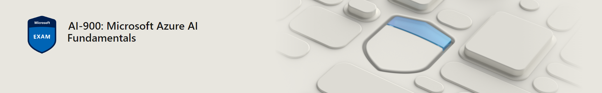

# MICROSOFT AI900 SESI HORTOLÂNDIA

 

<h2>RESUMO</h2>

O curso de Implantação de Serviços de Inteligência Artificial em Nuvem - Microsoft AI900 tem por objetivo preparar o estudante para possíveis certificações da Microsoft AI-900, desenvolvendo capacidades que possibilitem ao concluinte implementar serviços cognitivos de inteligência artificial, utilizando as principais tecnologias da área disponíveis nos serviços de nuvem.

 
 

Link para acessar plataforma Microsoft Learn <a href="https://learn.microsoft.com/pt-br/users/51140266/collections/p6ppcydkn77zqn">AI 900</a>

Link com vídeo explicativo <a href="https://www.youtube.com/watch?v=t9yyzw2J8bo">AI 900 VÍDEO</a>

Link para acessar Manual do Aluno <a  href="https://sumare.sp.senai.br/galeriaimagens/imageviewer.ashx?Url=30469">MANUAL</a>

Código da sala do classrom para entrar : j7xyozf 

Link com vídeo explicativo  de como entrar no classrom<a href="https://www.youtube.com/watch?v=4HZ7PiMaank">Classrom</a>

 
 

Link para acessar Simulado 01 <a  href="https://docs.google.com/forms/d/e/1FAIpQLScOCkxZGAlemgtcZqxw9N24Xb-VAGLmRiGAfIR9mEP4fMjXjA/viewform?pli=1&fbzx=-8445268781376170556">SIMULADO01</a>

 

Link para acessar Simulado 02 <a  href="https://docs.google.com/forms/d/e/1FAIpQLSenGcSR3M1p7jPc6iiwtIu1Ee1VSLLgNf521dyYBWUnilJLIA/viewform?usp=sf_link">SIMULADO02</a>

 

Link conteudo aula 27/09/2023 <a  href="https://learn.microsoft.com/pt-br/training/paths/create-no-code-predictive-models-azure-machine-learning/">Aula 27/09/2023</a>
 

aula 04/10/2023 <a  href="https://classroom.google.com/u/1/c/NjIzMzE0Njg5OTUz/a/NTkwMzMyODEyNDA5/submissions/by-status/and-sort-first-name/all">Aula 04/10/2023</a>

 

aula 11/10/2023 <a  href="https://classroom.google.com/u/2/w/NjIzMzE0Njg5OTUz/t/all">Aula 11/10/2023</a>

 

No google sala de aula ver passo a passo de como cadastrar conta Portal da Azure

Realizar mais um capitulo através do link para acessar plataforma Microsoft Learn <a href="https://learn.microsoft.com/pt-br/users/51140266/collections/p6ppcydkn77zqn">AI 900</a>

 

Link para acessar Simulado 03 <a  href="https://docs.google.com/forms/d/e/1FAIpQLSdhy63KCMVMUqTa8enor4ioo7UobQKFCF3XK3huXiRxnb90Ow/viewform?usp=sf_link">SIMULADO03</a>

*********************

aula 18/10/2023 <a  href="https://www.customvision.ai/">Aula 18/10/2023</a>

 Em grupo montar uma classificação de imagem na plataforma custom visiom e em uma apresentação explicar o por que a mesma seria util

Em duplas acessar o portal da azure e apontar dois recursos de Inteligência artificial e montar um pequeno relatório explicando para que serve esse recurso

NÃO HAVERÁ aula 25/10/2023 

 

*********************

 

Aula 01/11/2023 

Realizar atividades pendentes

 

Quem finalizar criar uma máquina virtual na azure instalar algum software qualquer e realizar demonstração em video

*********************

 

Aula 22/11/2023
   
  
Link para acessar plataforma Microsoft Learn <a href="https://learn.microsoft.com/pt-br/users/51140266/collections/p6ppcydkn77zqn">AI 900</a>

*********************

Link para acessar Simulado 04 <a  href="">SIMULADO04</a>

Link para acessar Simulado 05 <a  href="">SIMULADO05</a>

 

 

Link para acessar ATIVIDADE PRÁTICA01 <a  href="">ATIVIDADE01</a>

Link para acessar ATIVIDADE PRÁTICA02 <a  href="">ATIVIDADE02</a>

Link para acessar ATIVIDADE PRÁTICA03 <a  href="">ATIVIDADE03</a>

Link para acessar ATIVIDADE PRÁTICA04 <a  href="">ATIVIDADE04</a>

Link para acessar ATIVIDADE PRÁTICA05 <a  href="">ATIVIDADE05</a>

 

CURIOSIDADES: LABORATÓRIO DA GOOGLE PARA COMPARAÇÃO DE OBJETOS OR CLASSIFICAÇÃO: https://teachablemachine.withgoogle.com/

